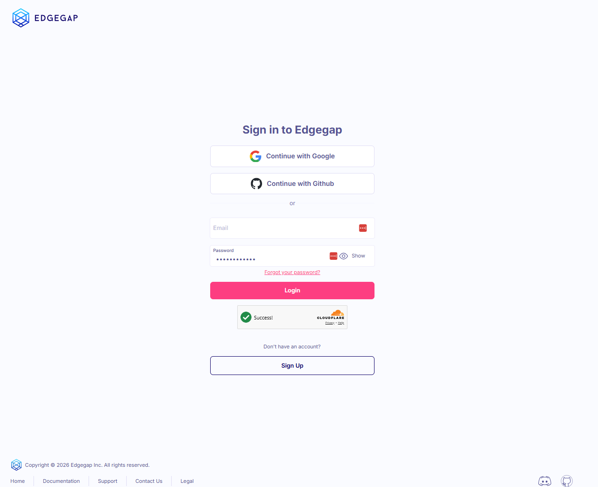

# Phaser: Real-time Multiplayer with Colyseus

Full source-code for the step-by-step tutorial on how to use Phaser + Colyseus together.

- [See step-by-step Tutorial](https://docs.colyseus.io/learn/examples/phaser)
- [See Colyseus documentation](https://docs.colyseus.io/)

## How to host with Edgegap
- from root: `docker build . -t registry.edgegap.com/[PROJECT]/[IMAGE]:[TAG]`
- push to Edgegap repository
- create app version:
    - 1GiB memory
    - 1 vCPU
    - Port mapping:
        - clientport: 80 HTTP
        - gameport: 7777 WS

This code sample is a fork of Colyseus phaser demo (which you can find here https://github.com/colyseus/tutorial-phaser)  with the right elements to host on Edgegap.

In this code sample, we packaged the demo above so it runs in a docker container on Edgegap’s platform. You will run both the client and the server within 1 container. 
URL to the project is the wrong, it needs to be : 

Pre-requesite: 
A linux machine (or wsl on windows) with docker installed.

Git clone https://github.com/edgegap/netcode-sample-colyseus-phaser.git

You need to build the docker image. You can build it on your machine and push it to a registry of your choice. Below we’ll push it to Edgegap’s registry. Make sure you are logged in your registry before running docker build (i.e. docker login)

docker build . -t registry.edgegap.com/[PROJECT]/[IMAGE]:[TAG]
docker push registry.edgegap.com/[PROJECT]/[IMAGE]:[TAG]

once your docker is successfully built and push to your registry of choice, you can go on Edgegap’s platform and create your game profile and get it running. 

Login on Edgegap portal app.edgegap.com

Click on “version”

 

Click on “create application”

 

Give it a name and click on “create application”

 

From there you can create your game profile. Give it a version name at the top, select 1 vcpu and 1 GB of ram, points the registry to the one you used above (in this case, docker hub below), select your container image and version, and click “submit”

 

You will be presented with a screen to select which port. You need to open 2 ports: http 80 and WS 7777. Add the first one and click on “Add Another”

 

You will end up with 2 ports like this:

 

At this point you can run your game. Scroll up and click on the top right corner button “Deploy”

 

Leave the settings as is and click “Deploy”

 

It will take a few seconds for the image to download and run, thus why you will see the “Deploying” information. 

 

Once ready, the icon will turn green and you will get the information about your running phaser game server. Scrolling down will get you the detailed information. 

 

You should now have a running deployment which includes your phaser server and browser! You can start by connecting to the server ui by opening the natted port for your 7777/ws using a web browser. 

 

You will get a similar page:

 

From there you can go back and connect to the client port. It’ll allow you to select one of the 4 mode by clicking on them. 

 

## License

- Source-code is licensed under MIT License.
- The [assets](https://www.kenney.nl/assets/pixel-shmup) are licensed under [CC0 1.0 Universal](https://creativecommons.org/publicdomain/zero/1.0/). 
